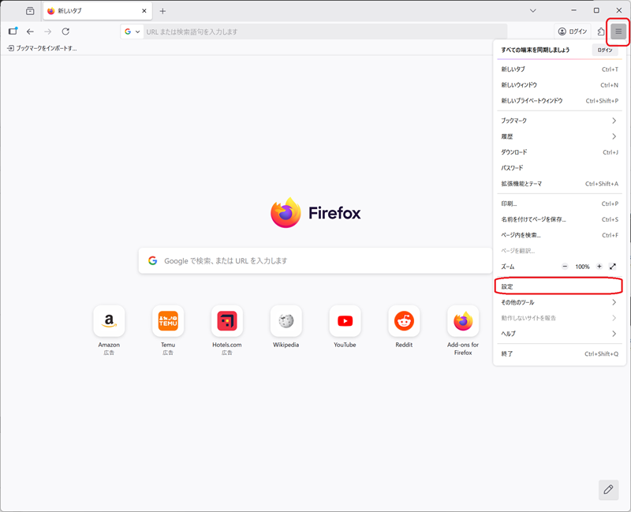
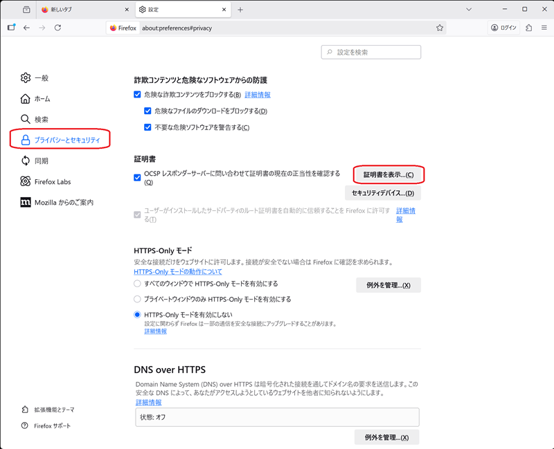
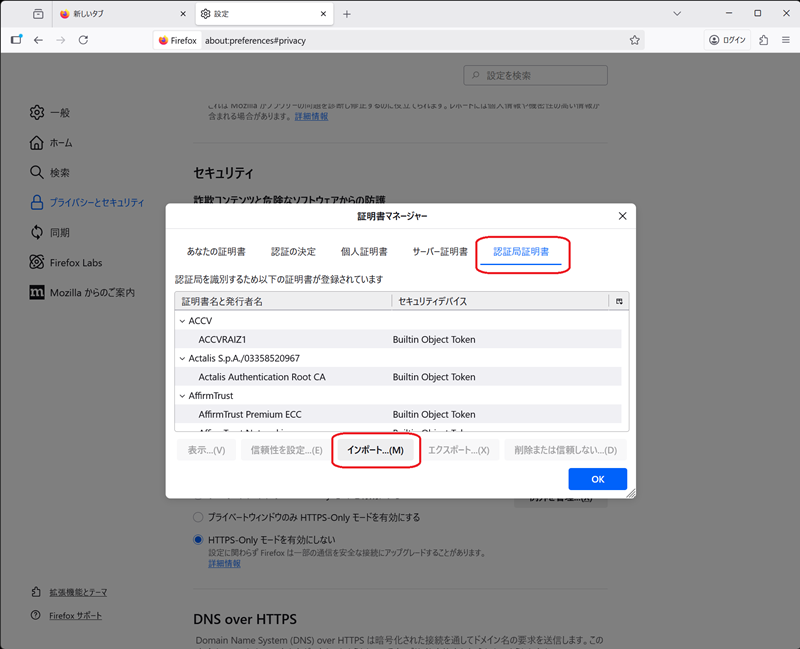
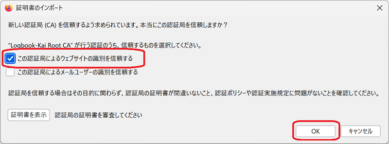
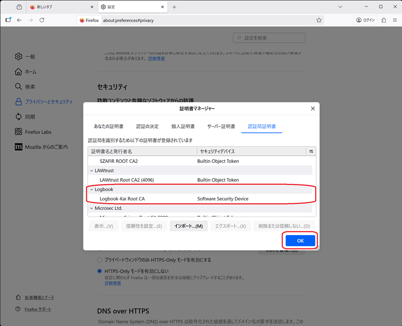

# 証明書のインストール（Firefox専用）

Firefoxでは独自の証明書ストアを使用するため、Windows標準の証明書ストアとは別に証明書をインストールすることが出来ます。

※Firefox Ver144.0 で動作確認済み

## インストール手順

### 1. 設定を開く

Firefoxのメニューから設定を開きます。

### 2. プライバシーとセキュリティを選択

左側のメニューから「プライバシーとセキュリティ」を選択し、「証明書」セクションまでスクロールして「証明書を表示...」をクリックします。

### 3. 証明書をインポート

証明書マネージャーが開いたら、「認証局証明書」タブで「インポート...」ボタンをクリックします。

### 4. 証明書ファイルを選択

ファイル選択ダイアログで、航海日誌のディレクトリにある `logbook-ca.crt` ファイルを選択してインポートします。  
この証明局によるウェブサイトの識別を信頼するにチェックボックスを付けてください

### 5. 確認

証明書マネージャーで証明書リストをスクロールし、「Logbook」が追加されていることを確認します。

以上で完了です。

[戻る](how-to-preference.md)