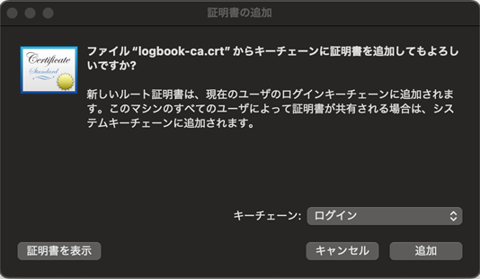
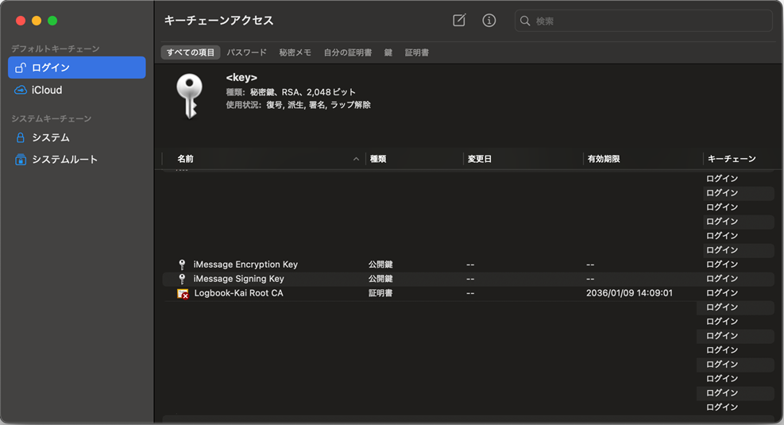
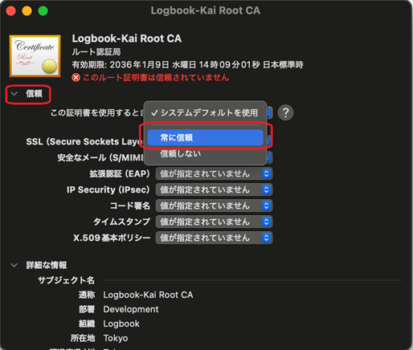

# 証明書のインストール（macOS）

macOSでは、キーチェーンアクセスを使用して証明書をインストールします。

## インストール手順

証明書のインストールには、以下の2つの方法があります。

### 方法1：キーチェーンアクセスを使用する方法

#### 1. 証明書ファイルを開く

作成された `logbook-ca.crt` ファイルをダブルクリックするか、キーチェーンアクセスでインポートします。

#### 2. キーチェーンアクセスで証明書を確認

1. 「アプリケーション」→「ユーティリティ」→「キーチェーンアクセス」を開きます
2. 左側の「ログイン」キーチェーンを選択します
3. 「証明書」カテゴリを選択します
4. 「Logbook-Kai Root CA」という証明書が表示されることを確認します



#### 3. 証明書を「常に信頼」に設定

1. 「Logbook-Kai Root CA」証明書をダブルクリックして開きます



2. 「信頼」セクションを展開します
3. 「この証明書を使用する場合:」のドロップダウンメニューで「常に信頼」を選択します



4. 変更を保存します（パスワードの入力が求められる場合があります）

### 方法2：ターミナルを使用する方法（推奨）

ターミナルを使用すると、より簡単に証明書をインストールできます。この方法では、「常に信頼」の設定は自動的に行われます。

1. ターミナルを開きます
2. 証明書ファイル（`logbook-ca.crt`）が保存されているディレクトリに移動します
   - 例：航海日誌の起動ディレクトリに証明書が保存されている場合
3. 以下のコマンドを実行します：

```bash
security add-trusted-cert -d -r trustRoot -k ~/Library/Keychains/login.keychain-db ./logbook-ca.crt
```

**注意：**
- 証明書ファイルのパスは、実際に証明書が保存されているディレクトリに合わせて調整してください
- このコマンドを実行すると、証明書が「ログイン」キーチェーンに追加され、自動的に「常に信頼」に設定されます
- パスワードの入力が求められる場合があります

### ブラウザの再起動

証明書の設定後、**必ずブラウザを完全に再起動してください**（⌘+Qで完全に終了してから再度起動）。

### ⚠️ 注意事項

- **Safariの場合**: 
  - 「常に信頼」を設定した後、**Safariを完全に再起動**（⌘+Q）してください

- **Chrome/Edgeの場合**: 
  - ⚠️ **重要**: Chrome/Edgeを使用する場合、証明書を「ログイン」キーチェーンに追加するだけでは不十分です。「システム」キーチェーンにも追加する必要があります。
  - 以下の手順に従って、「システム」キーチェーンに証明書を追加してください。

#### Chrome/Edge用：システムキーチェーンへの証明書追加

**方法1：キーチェーンアクセスを使用する方法**

1. キーチェーンアクセスの左側で「システム」キーチェーンを選択します
2. `logbook-ca.crt` ファイルをキーチェーンアクセスのウィンドウにドラッグ＆ドロップします
3. 管理者のユーザー名とパスワードを求められた場合、入力して承認します
4. 「システム」キーチェーンに追加された証明書をダブルクリックして開きます
5. 「信頼」セクションを展開し、「この証明書を使用する場合:」で「常に信頼」を選択します
6. 変更を保存します

**方法2：ターミナルを使用する方法（推奨）**

1. ターミナルを開きます
2. 証明書ファイル（`logbook-ca.crt`）が保存されているディレクトリに移動します
3. 以下のコマンドを実行します（管理者権限が必要です）：

```bash
sudo security add-trusted-cert -d -r trustRoot -k /Library/Keychains/System.keychain ./logbook-ca.crt
```

**注意：**
- 証明書ファイルのパスは、実際に証明書が保存されているディレクトリに合わせて調整してください
- このコマンドを実行すると、証明書が「システム」キーチェーンに追加され、自動的に「常に信頼」に設定されます
- 管理者のパスワードの入力が求められます

- **Firefoxの場合**: 
  - ⚠️ **重要**: Firefoxは独自の証明書ストアを使用するため、macOSのキーチェーンに証明書を追加しても、Firefoxはそれを使用しません。
  - Firefoxの証明書マネージャーから直接インポートする必要があります。
  - 詳細な手順については、[Firefox専用の証明書インストール手順](how-to-certificate-firefox.md)を参照してください。

---

[戻る](how-to-preference.md)
