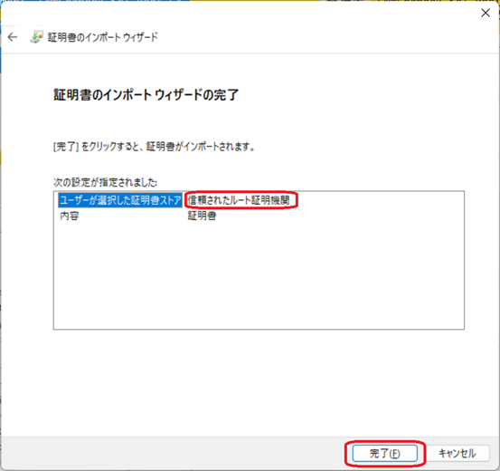

# 証明書のインストール（Windows）

Windowsでは、証明書のインポートウィザードを使用して証明書をインストールします。

## インストール手順

### 1. 証明書ファイルを開く

作成された `logbook-ca.crt` ファイルをダブルクリックすると、証明書の情報画面が開きます。

### 2. インポートウィザードを開始

「証明書のインストール」ボタンをクリックします。

保存場所は「現在のユーザー」を選択し、「次へ」をクリックします。

### 3. 証明書ストアを選択

「証明書をすべて次のストアに配置する」を選択し、「参照」ボタンをクリックします。

「信頼されたルート証明機関」を選択し、OKをクリックします。

### 4. インポートを完了

「完了」ボタンをクリックします。

セキュリティ警告が表示されたら、「はい」を選択します。

これで証明書のインストールが完了しました。

### ⚠️ 重要：ブラウザの再起動が必要です

証明書のインストール後、**必ずブラウザを再起動してください**。

ブラウザを再起動しないと、証明書が正しく認識されず、艦これにアクセスできない場合があります。

---

[戻る](how-to-preference.md)
