# 航海日誌 使い方

航海日誌を使用しながら艦これで遊ぶには、以下の設定が必要となります。

* 証明書の作成と証明書のインストール
* プロキシ設定

# 証明書の作成と証明書のインストール

2025年10月より、艦これがHTTPS化されました。そのため、従来の形式ではデータを受信できなくなりました。

本ソフトでは、MITM (Man-In-The-Middle) Proxyという形でデータを受信しています。これを実現するためには、証明書の作成と、その証明書をブラウザに信頼させる必要があります。

## 証明書の作成

### 1. 初回起動時のメッセージ

通常、初回起動時には証明書が存在しないため、以下のメッセージが表示されます。

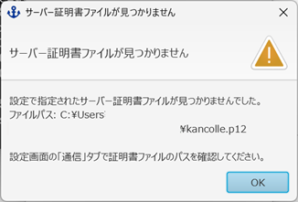

### 2. 証明書作成画面を開く

OKを押すと `[設定] - [通信]` 画面が開きますので、「証明書作成」ボタンをクリックしてください。

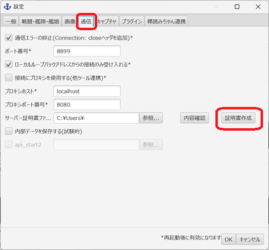

### 3. 証明書を作成する

証明書作成画面が表示されます。

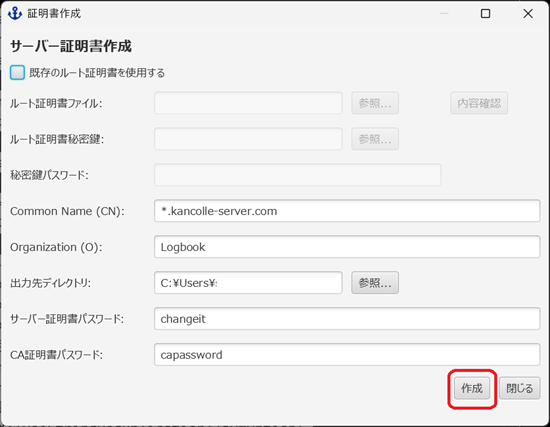

「出力先ディレクトリ」は初期値として起動ディレクトリが設定されていますので、そのまま「作成」ボタンをクリックしてください。

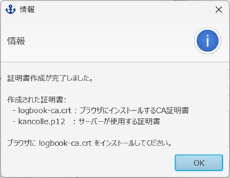

上記のメッセージが表示されれば、証明書の作成は完了です。

### 注意事項

`[設定] - [通信]` の「サーバー証明書ファイル」には、起動ディレクトリの `kancolle.p12` ファイルが指定されているはずです。「ファイルが見つかりません」などのエラーが出た場合は、パスを確認してください。

また、`[設定]` 画面をOKで閉じる際に、サーバー証明書ファイルに問題がある場合は以下のメッセージが表示されます。

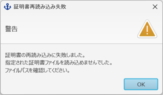

この場合は、再度 `[設定]` を開き、証明書の作成をやり直してください。

## 証明書のインストール（Windows標準）

作成された `logbook-ca.crt` ファイルをダブルクリックすると、証明書の情報画面が開きます。

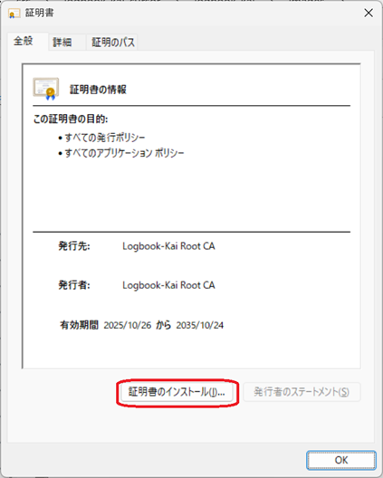

### 1. インポートウィザードを開始

「証明書のインストール」ボタンをクリックします。

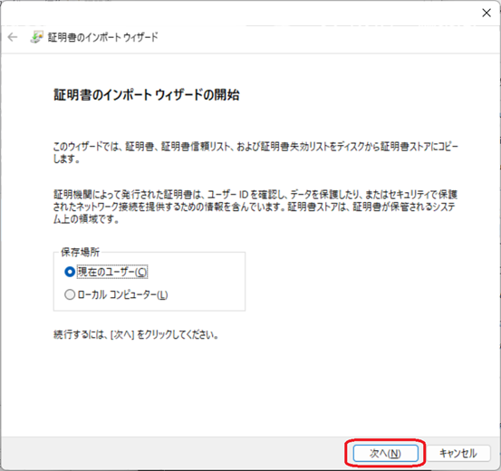

保存場所は「現在のユーザー」を選択し、「次へ」をクリックします。

### 2. 証明書ストアを選択

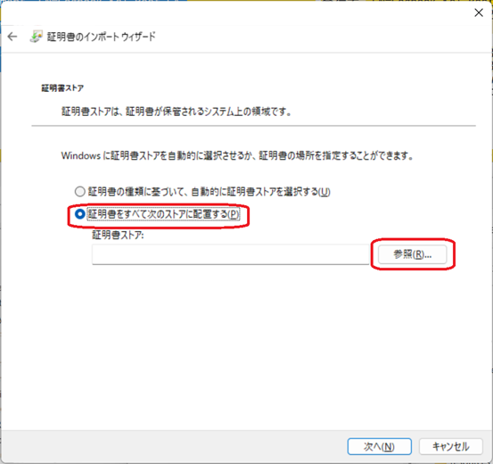

「証明書をすべて次のストアに配置する」を選択し、「参照」ボタンをクリックします。

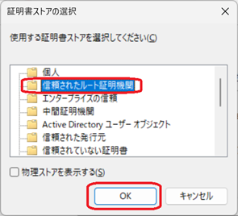

「信頼されたルート証明機関」を選択し、OKをクリックします。

### 3. インポートを完了

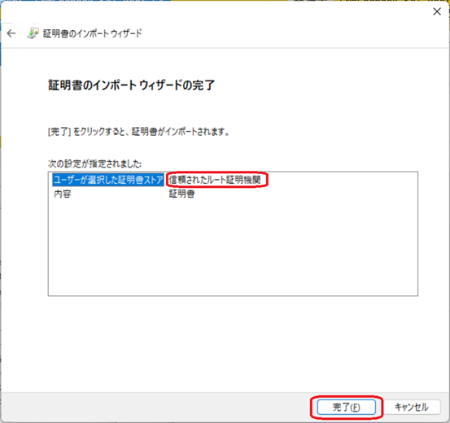

「完了」ボタンをクリックします。

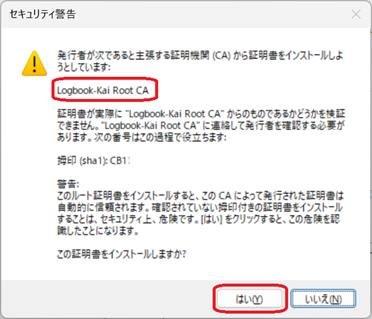

セキュリティ警告が表示されたら、「はい」を選択します。

これで証明書のインストールが完了しました。

## Firefoxをお使いの場合

Firefoxは独自の証明書ストアを使用できるため、上記の手順とは異なる方法で証明書をインストールすることができます。

詳細な手順については、[Firefox専用の証明書インストール手順](how-to-certificate-firefox.md)を参照してください。

---

# プロキシ設定

航海日誌を使用しながら艦これで遊ぶには、プロキシの設定が必要となります。

お使いのブラウザによって設定方法が異なりますので、以下の該当する項目を参照してください。

* Mozilla Firefoxの場合
* Google Chromeの場合

**注意事項**  
プロキシの設定を行うと、航海日誌を起動していない状態では艦これにアクセスできなくなります。航海日誌を使用しない場合は、設定を元に戻してください（逆の手順で戻します）。

## Firefoxの場合

### 1. 自動プロキシ構成スクリプトを開く

航海日誌を起動後、`[その他] - [自動プロキシ構成スクリプト]` を選択します。

**※ 注意**  
航海日誌が「スレッドが予期せず終了しました」というエラーメッセージを出した場合、ポートを8888から任意の別のポートに変更してください。

### 2. スクリプトファイルを保存してアドレスをコピー

「保存...」を選択してスクリプトファイルを保存した後、Firefox用のアドレスをコピーします。

### 3. Firefoxの接続設定に登録

Firefoxの [オプション](about:preferences) を開き、`[詳細] - [ネットワーク] - [接続設定]` を選択します。

「自動プロキシ設定スクリプトURL」に、先ほどコピーしたアドレスを貼り付けます。

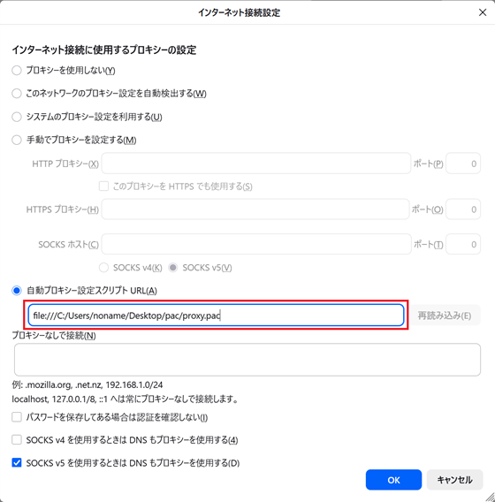

設定は以上です。

## Chromeの場合

Google Chrome単体ではプロキシの設定ができないため、拡張機能のインストールが必要です。

ここでは [SwitchySharp](https://chrome.google.com/webstore/detail/proxy-switchysharp/dpplabbmogkhghncfbfdeeokoefdjegm) を例にして説明します。

### 1. 自動プロキシ構成スクリプトを開く

航海日誌を起動後、`[その他] - [自動プロキシ構成スクリプト]` を選択します。

**※ 注意**  
航海日誌が「スレッドが予期せず終了しました」というエラーメッセージを出した場合、ポートを8888から任意の別のポートに変更してください。

### 2. スクリプトファイルを保存

「保存...」を選択してスクリプトファイルを保存します。

（Firefox用のアドレスは使用しません）

### 3. SwitchySharpにプロファイルを作成

SwitchySharpのオプションで新しいプロファイルを作成します。

「Import PAC File」を選択し、前の手順で作成したPACファイルを選択して保存します。

### 4. プロファイルを有効にする

作成したプロファイルを有効にします。

設定は以上です。
